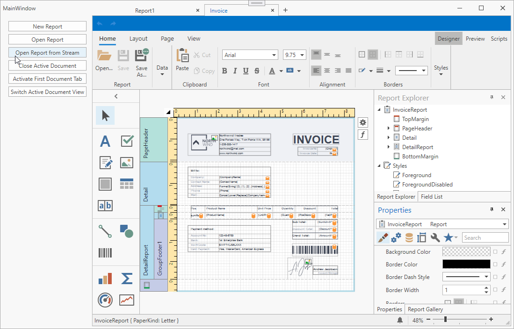

<!-- default badges list -->

<!-- default badges end -->
# How to Use MVVM Framework to Create Commands that Manage Documents in the Report Designer

This example demonstrates how to use the MVVM framework to create custom commands that have access to the [ReportDesigner](https://docs.devexpress.com/WPF/DevExpress.Xpf.Reports.UserDesigner.ReportDesigner) API. The user can click a button with a linked command to create or open a report, and switch tabs or document views.

 The project defines the `IReportDesignerAPIService` interface. The code contains the `ReportDesignerAPIService` class that implements this interface and calls the [ReportDesigner](https://docs.devexpress.com/WPF/DevExpress.Xpf.Reports.UserDesigner.ReportDesigner) API methods. The `ReportDesignerAPIService` class is specified as a custom MVVM Framework [Behaviour](https://docs.devexpress.com/WPF/17442/mvvm-framework/behaviors) element to get access to the [RepotDesigner](https://docs.devexpress.com/WPF/DevExpress.Xpf.Reports.UserDesigner.ReportDesigner) object in the window.

The `MainViewModel` gets the **IReportDesignerAPIService** service from the service container and creates a set of [POCO View Model commands](https://docs.devexpress.com/WPF/17352/mvvm-framework/viewmodels/runtime-generated-poco-viewmodels#commands) whose code utilizes the **IReportDesignerAPIService** service methods. 

<!-- default file list -->
## Files to Look At

- [MainWindow.xaml](./CS/MainWindow.xaml) ([MainWindow.xaml](./VB/MainWindow.xaml))
- [MainViewModel.cs](./CS/MainViewModel.cs) ([MainViewModel.vb](./VB/MainViewModel.vb))
- [IReportDesignerAPIService.cs](./CS/IReportDesignerAPIService.cs) ([IReportDesignerAPIService.vb](./VB/IReportDesignerAPIService.vb))

<!-- default file list end -->

## Documentation

- [Report Designer API and Customization](https://docs.devexpress.com/XtraReports/115737/wpf-reporting/end-user-report-designer-for-wpf/api-and-customization)
- [DevExpress MVVM Framework](https://docs.devexpress.com/WPF/15112/mvvm-framework)

## More Examples

- [How to override the Report Designer command handlers](https://github.com/DevExpress-Examples/Reporting_how-to-override-the-report-designer-command-handlers-t461334)
